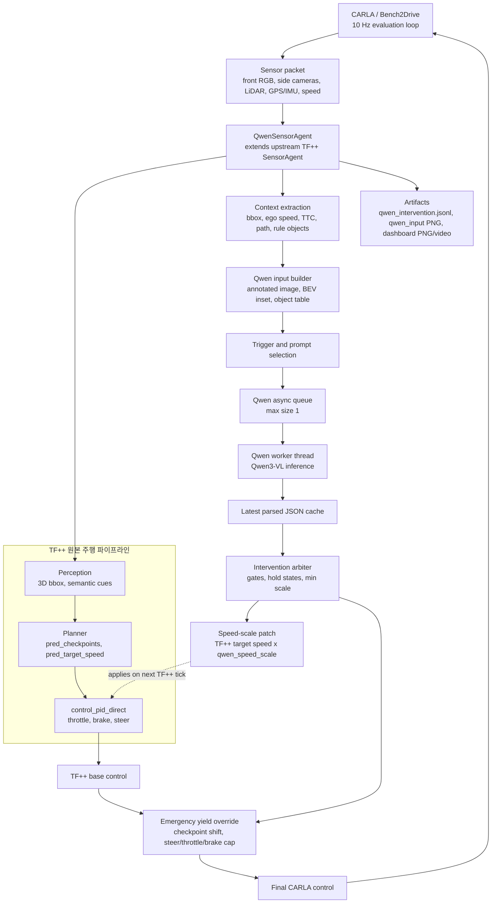
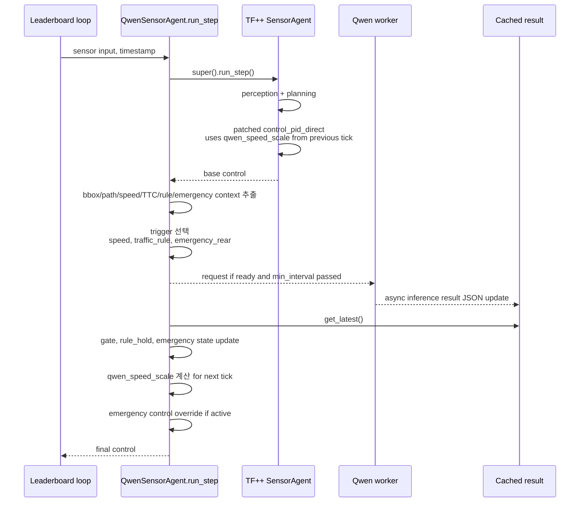
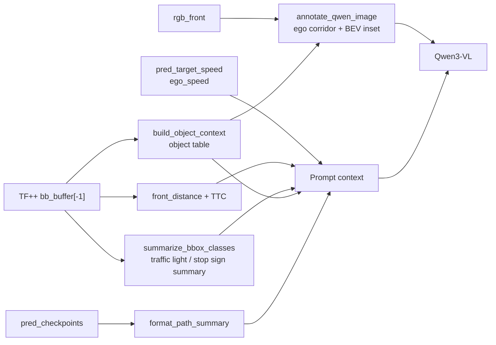
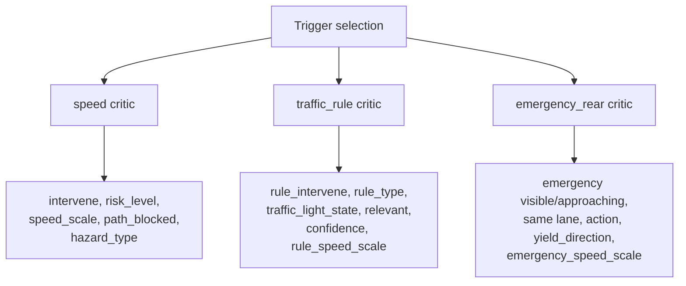
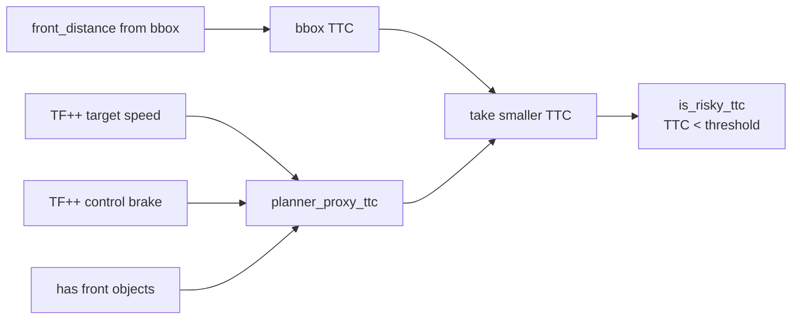
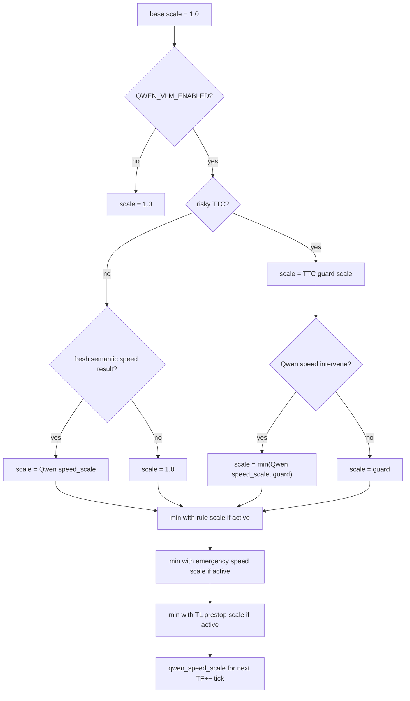
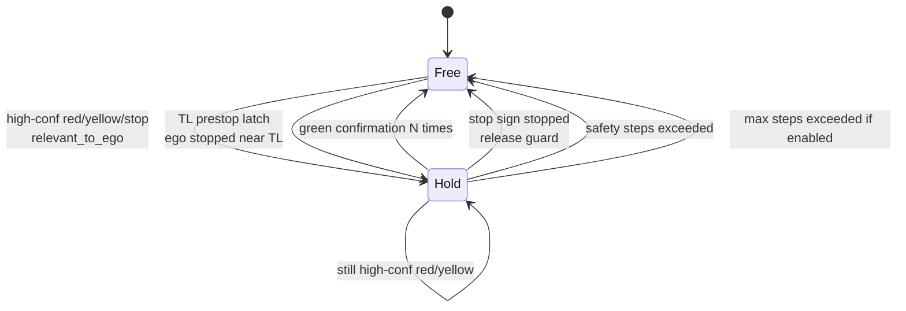
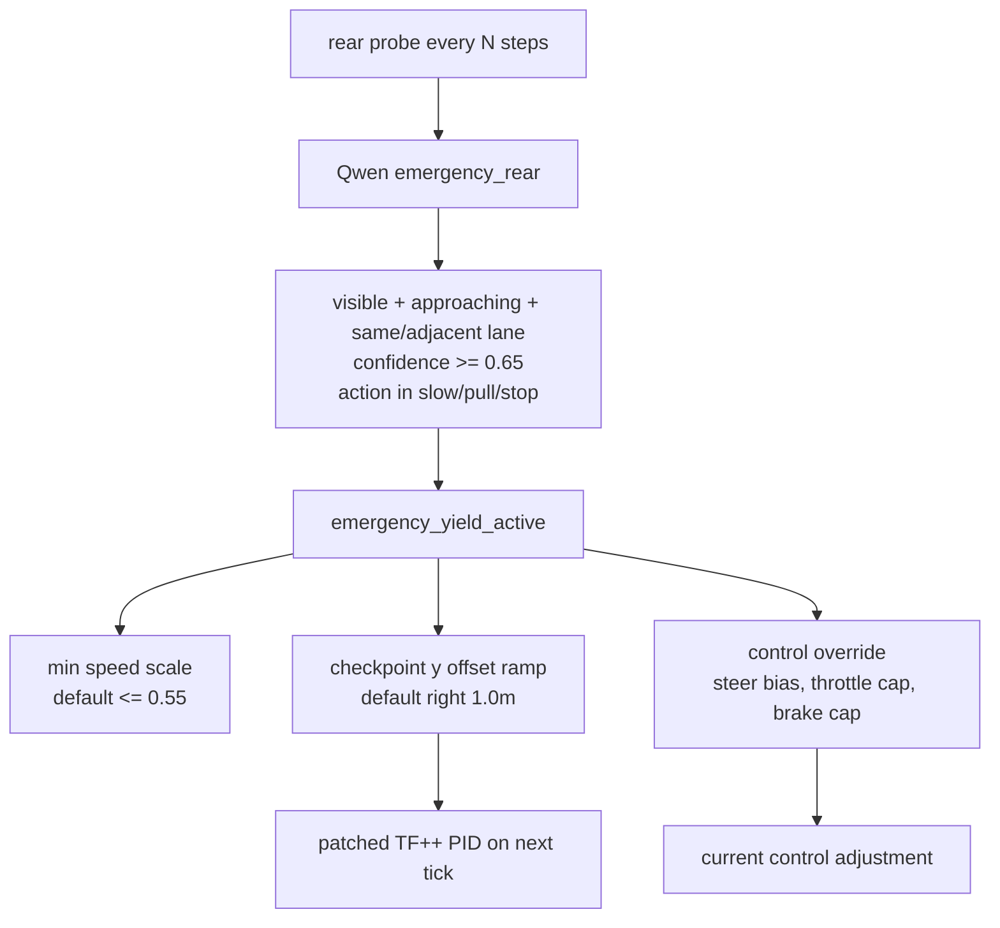

# TF++ + Qwen 현재 방법론 아키텍처

작성 기준: 2026-04-28  
대상 코드: `carla_garage/src/garage_ext/agents/qwen_sensor_agent.py`, `carla_garage/src/garage_ext/vlm_intervention/`, `carla_garage/run_qwen_dev10.sh`

## 1. 한 줄 요약

현재 구조는 **TF++를 primary driver로 유지**하고, **Qwen3-VL-8B-Instruct를 비동기 보조 critic**으로 붙인 hybrid 방식이다. Qwen은 직접 운전하지 않는다. 전방 위험, 교통 규칙, 후방 응급차 상황을 판단해서 TF++의 목표 속도에 곱할 `speed_scale`을 만들고, 응급차 yield 상황에서는 제한적으로 checkpoint shift와 control override를 추가한다.

```text
TF++ = 주행 본체: perception, planning, control
Qwen = 보조 판단기: speed critic, traffic-rule critic, emergency-rear yield critic
개입 방식 = target_speed x speed_scale + emergency yield 보정
```

## 2. 전체 아키텍처



핵심 설계는 **Qwen 추론이 control loop를 막지 않는 것**이다. Qwen 요청은 background thread로 보내고, main loop는 항상 즉시 최신 cache만 읽는다. 추론이 늦거나 queue가 바쁘면 해당 step의 Qwen 요청은 skip된다.

## 3. 실행 단위 흐름



주의할 점은 `speed_scale`의 시간 축이다. `control_pid_direct()`는 `super().run_step()` 내부에서 먼저 호출되므로, 그 순간에는 이전 tick에서 계산된 `_qwen_speed_scale`이 적용된다. 현재 tick에서 새로 읽은 Qwen 결과는 보통 다음 tick의 TF++ target speed에 반영된다. 대신 emergency control override는 TF++ control이 나온 뒤 현재 tick control을 직접 보정할 수 있다.

## 4. TF++가 담당하는 것

Qwen을 붙여도 TF++는 계속 주행의 중심이다.

| TF++ 역할 | 현재 사용 위치 | 설명 |
|---|---|---|
| 센서 기반 perception | `SensorAgent.run_step()` | 3D bbox, route context, planner input 생성 |
| 경로 예측 | `_captured_tfpp_checkpoints` | Qwen prompt의 path summary와 emergency checkpoint shift에 사용 |
| 목표 속도 | `_captured_tfpp_target_speed` | Qwen 개입 전 기준 속도 |
| 저수준 제어 | `control_pid_direct()` | `pred_target_speed * speed_scale`로 throttle/brake/steer 산출 |
| 원본 control | `control` | emergency override 전 기본 제어값 |

TF++ bbox는 ego 좌표계 기준으로 해석한다.

| bbox index | 의미 |
|---:|---|
| `0` | `x`, ego 기준 전방 거리 m, 양수는 앞 |
| `1` | `y`, ego 기준 우측 거리 m, 양수는 오른쪽 |
| `2`, `3` | width, length |
| `4` | yaw |
| `5` | object speed |
| `7` | class id: `0 vehicle`, `1 pedestrian`, `2 traffic_light`, `3 stop_sign`, `4 emergency_vehicle` |
| `8` | detection score |

## 5. Qwen이 받는 입력

Qwen은 raw image만 받지 않는다. TF++의 내부 신호를 VLM이 이해할 수 있게 시각 및 텍스트 context로 재구성한다.



### 5.1 Speed / traffic-rule 입력 이미지

`annotate_qwen_image()`가 front RGB에 다음 정보를 얹는다.

| 레이어 | 내용 |
|---|---|
| 원본 이미지 | `rgb_front` |
| ego corridor hint | 노란 주행 코리도, Qwen이 ego lane을 혼동하지 않게 하기 위함 |
| header | ego speed, front distance, TTC, TF++ target speed, traffic light/stop sign count |
| BEV inset | bbox를 top-down으로 표시, red primary / yellow same-lane / gray other object |

### 5.2 Emergency-rear 입력 이미지

응급차 yield prompt에서는 `rgb_front`와 추가된 `rgb_rear`를 세로 2-panel 이미지로 합친다.

| 패널 | 용도 |
|---|---|
| TOP front camera | 좌/우로 비켜도 되는지 전방 여유 공간 확인 |
| BOTTOM rear camera | 뒤에서 접근하는 응급차 존재 여부 확인 |

`rgb_rear` 센서는 `QWEN_DASHBOARD_REAR=1` 또는 `QWEN_EMERGENCY_PULL_OVER=1`일 때 `sensors()`에서 추가된다.

### 5.3 텍스트 context

| 항목 | 생성 함수 또는 상태 | Qwen에게 주는 의미 |
|---|---|---|
| `object_table` | `format_object_table()` | 객체 id, class, x/y 위치, same-lane 여부, score |
| `rule_context` | `format_rule_context()` | TF++가 본 traffic light / stop sign 후보 |
| `path_summary` | `format_path_summary()` | TF++ planned checkpoints |
| `ttc_history` | `format_ttc_history()` | 최근 거리와 TTC 변화 |
| `tfpp_target_speed` | `_format_speed()` | TF++가 원래 원하는 속도 |
| `emergency_state` | `_format_emergency_state()` | 현재 yield 상태와 이전 판단 |

### 5.4 이미지 보정 + VLM front-only 실험

`QWEN_IMAGE_ENHANCER=classic_cv`를 켜면 `QwenSensorAgent`가 `super().run_step()` 전에 선택된 RGB frame을 보정한다. 따라서 TF++ perception/planning도 보정된 front image를 보고, Qwen도 같은 보정본 위에 ego corridor/BEV를 얹은 이미지를 받는다.

```text
CARLA rgb_front
  -> classic_cv image enhancer
  -> TF++ run_step
  -> Qwen annotated input
```

front-only dev10 실험은 `run_qwen_enhance_dev10.sh`로 실행한다. 이 스크립트는 후방 입력을 쓰지 않기 위해 `QWEN_DASHBOARD_REAR=0`, `QWEN_EMERGENCY_PULL_OVER=0`을 고정한다.

## 6. Qwen prompt 모드

현재 Qwen은 세 가지 critic으로 동작한다.



| 모드 | 사용 상황 | 판단 |
|---|---|---|
| `speed` | TTC 위험, 전방 근접 객체, 일반 object probe | 전방 차량/보행자/장애물 때문에 속도를 줄여야 하는가 |
| `traffic_rule` | 신호등/정지표지 후보, rule hold polling, 곡률 기반 교차로 probe | ego lane에 relevant한 red/yellow light 또는 stop sign인가 |
| `emergency_rear` | 후방 카메라가 있고 주기적 rear probe 조건을 만족 | 뒤에서 응급차가 접근하며 ego가 양보해야 하는가 |

## 7. Qwen 호출 트리거

한 step에서 여러 조건이 참일 수 있지만 실제 prompt 선택은 우선순위가 있다. 현재 우선순위는 `emergency_rear`가 가장 높고, 그 다음 `traffic_rule`, 그 다음 일반 speed 계열이다.

| trigger | 조건 요약 | prompt mode | 기본 interval |
|---|---|---|---|
| `emergency_rear` | rear image 있음, `QWEN_EMERGENCY_REAR_PROBE_STEPS` 주기, rule hold 아님 | `emergency_rear` | `1.5s` |
| `traffic_rule` | TL/stop bbox 후보, rule hold polling, rule periodic probe | `traffic_rule` | hold `0.5s`, TL visible `0.8s`, 일반 `2.0s` |
| `ttc` | `TTC < QWEN_TTC_THRESHOLD`, 기본 `3.0s` | `speed` | `2.0s` |
| `proximity` | front distance `< QWEN_VLM_PROBE_DISTANCE`, 기본 `35m` | `speed` | `2.0s` |
| `object` | bbox 객체 있음, ego speed `> 0.5m/s` | `speed` | `2.0s` |
| `curve` | path curvature `>= QWEN_CURVE_PROBE_THRESH`, 기본 `0.25rad` | `traffic_rule` | `2.0s` |
| `periodic` | `QWEN_VLM_PERIODIC_STEPS > 0`일 때 N step마다 | `speed` | `2.0s` |

`QwenVLMClient`는 queue size를 1로 둔다. 이미 추론 중이거나 min interval이 지나지 않았으면 새 요청은 버린다. 오래된 frame이 줄 서서 늦게 반영되는 것을 막기 위한 설계다.

## 8. TTC와 planner proxy

기본 TTC는 단순하다.

```text
TTC = front_distance / ego_speed
```

단, bbox가 없거나 불안정할 때 TF++가 이미 강하게 감속하려는 신호를 위험 proxy로 쓴다.



`ttc_guard_scale()`은 TTC가 작을 때 Qwen 결과가 아직 없어도 speed scale을 제한한다.

| TTC source | 조건 | guard scale |
|---|---|---:|
| `planner_proxy` | `ttc <= 1.0` | `0.55` |
| `planner_proxy` | `1.0 < ttc < 2.0` | `0.75` |
| `planner_proxy` | `2.0 <= ttc < threshold` | `0.90` |
| `bbox` | `ttc <= 0.75` | `0.0` |
| `bbox` | `0.75 < ttc < 1.0` | `0.2` |
| `bbox` | `1.0 <= ttc < 2.0` | `0.5` |
| `bbox` | `2.0 <= ttc < threshold` | `0.8` |

## 9. Speed scale arbitration

최종 `qwen_speed_scale`은 여러 critic 결과 중 가장 보수적인 값을 취한다.



실제 적용 위치는 `_patch_speed_scale()`이다.

```text
scaled_target_speed = pred_target_speed * agent._qwen_speed_scale
control_pid_direct(shifted_checkpoints, scaled_target_speed, speed, ...)
```

## 10. Traffic rule hold

Traffic rule critic은 단발성 Qwen 결과를 그대로 쓰지 않고 state machine으로 관리한다.



Hold 진입 조건은 다음 gate를 모두 통과해야 한다.

| gate | 기본값 |
|---|---:|
| `rule_intervene == true` | required |
| `relevant_to_ego == true` | required |
| `rule_type in red_light/yellow_light/stop_sign` | required |
| `rule_confidence >= QWEN_RULE_CONFIDENCE_THRESH` | `0.75` |
| result age `<= QWEN_RULE_MAX_AGE_STEPS` | `20 steps` |
| `rule_speed_scale < 0.95` | required |
| post-release cooldown 아님 | `50 steps` |

Hold 중에는 `rule_speed_scale = 0.0`으로 완전 정지한다. Green release는 기본적으로 `green + relevant + confidence >= 0.75`를 `QWEN_RULE_HOLD_GREEN_CONFIRMATIONS`회 연속 확인해야 한다. `QWEN_RULE_HOLD_SAFETY_STEPS=150`은 hard fallback이다.

TL prestop은 Qwen 응답이 오기 전에도 신호등 bbox가 최근에 보이면 임시로 `min(scale, 0.45)`를 적용한다. 이 상태에서 ego speed가 충분히 낮은 frame이 누적되면 `traffic_light_wait` hold로 승격되어 green을 기다린다.

## 11. Emergency vehicle yield

현재 구현은 후방 응급차 yield를 별도 prompt로 다룬다. 예전 문서에 없던 rear-camera 기반 yield 판단이 추가된 부분이다.



Qwen emergency output은 다음처럼 해석된다.

| Qwen field | 사용 방식 |
|---|---|
| `emergency_vehicle_visible` | rear panel에서 응급차가 보이는지 |
| `approaching_from_rear` | 뒤에서 접근 중인지 |
| `same_or_adjacent_lane` | ego와 같은/인접 차선인지 |
| `confidence` | 기본 `>= 0.65`일 때만 act |
| `recommended_action` | `slow_yield`, `pull_left_yield`, `pull_right_yield`, `stop_yield` |
| `yield_direction` | 좌/우 yield 방향, 이후 side occupancy cost로 보정 |
| `speed_scale` | action별 cap 적용 후 emergency speed scale |

양보가 활성화되면 `QWEN_EMERGENCY_HOLD_STEPS=80` 동안 상태를 유지한다. lateral pull-over는 checkpoint의 `y` 좌표를 ramp 방식으로 이동시키며, `QWEN_EMERGENCY_CONTROL_OVERRIDE=1`이면 steer/throttle/brake를 직접 제한해서 비켜나는 동작을 더 강하게 만든다.

## 12. 런타임 설정

`run_qwen_dev10.sh`의 현재 기본값 기준 주요 설정은 다음과 같다.

| 변수 | 기본값 | 의미 |
|---|---:|---|
| `QWEN_VLM_ENABLED` | `1` | Qwen 개입 on/off |
| `QWEN_MODEL` | `/mnt/2/pretrained_models/Qwen3-VL-8B-Instruct` | local Qwen3-VL 모델 |
| `QWEN_VLM_DEVICE` | `cuda:1` on 2 GPUs | TF++와 Qwen GPU 분리 |
| `QWEN_VLM_THINKING` | `0` | Qwen3 thinking 비활성화, 속도 우선 |
| `QWEN_TTC_THRESHOLD` | `3.0` | risky TTC threshold |
| `QWEN_IMAGE_ENHANCER` | off / `classic_cv` in enhance run | front image 보정 모듈 |
| `QWEN_IMAGE_ENHANCE_TARGETS` | `rgb_front` | 보정할 RGB sensor id |
| `QWEN_IMAGE_ENHANCE_SAVE_COMPARE` | `1` in enhance run | original/enhanced 비교 PNG 저장 |
| `QWEN_SENSITIVE_TTC` | `1` | planner proxy TTC 사용 |
| `QWEN_MAX_OBJECTS` | `8` | prompt object table 최대 객체 수 |
| `QWEN_SAVE_INPUTS` | `1` | Qwen input PNG 저장 |
| `QWEN_RULE_CRITIC_ENABLED` | `1` | traffic rule prompt 사용 |
| `QWEN_RULE_ACTIVE` | `1` | rule result 실제 개입 허용 |
| `QWEN_RULE_CONFIDENCE_THRESH` | `0.75` | rule gate confidence |
| `QWEN_TL_PRESTOP_SCALE` | `0.45` | TL 후보가 보일 때 선제 감속 |
| `QWEN_CURVE_PROBE_THRESH` | `0.25` | 교차로/회전 선제 rule probe |
| `QWEN_DASHBOARD_REAR` | `1` | dashboard용 후방 카메라 |
| `QWEN_EMERGENCY_PULL_OVER` | `1` | emergency rear yield prompt 및 state 사용 |
| `QWEN_EMERGENCY_SPEED_SCALE` | `0.55` | emergency active 시 기본 속도 cap |
| `QWEN_EMERGENCY_RIGHT_OFFSET_M` | `1.0` | pull-over checkpoint lateral offset |
| `QWEN_EMERGENCY_CONTROL_OVERRIDE` | `1` | current control steer/throttle/brake override |

실행 entry point는 다음이다.

```text
TEAM_AGENT=/mnt/2/carla_garage/src/garage_ext/agents/qwen_sensor_agent.py
TEAM_CONFIG=/mnt/2/pretrained_models/all_towns
ROUTES=/mnt/2/carla_garage/Bench2Drive/leaderboard/data/drivetransformer_bench2drive_dev10.xml
OUT_DIR=/mnt/2/carla_metric_result/qwen_rear_2
```

## 13. 로그와 분석 산출물

| artifact | 위치 | 내용 |
|---|---|---|
| `eval.json` | `carla_metric_result/<run>/eval.json` | leaderboard score, infraction, route status |
| `eval.log` | `carla_metric_result/<run>/eval.log` | 실행 로그, Qwen/model/load/timeout 로그 |
| `qwen_intervention.jsonl` | `viz/<route>/qwen_intervention.jsonl` | step별 Qwen trigger, raw response, parsed result, scale, rule/emergency state |
| `qwen_input/*.png` | `viz/<route>/qwen_input/` | Qwen에 실제 들어간 이미지 |
| dashboard PNG/video | `viz/<route>/dashboard/` 등 | front/rear view, Qwen state, scale, TTC, rule hold 시각화 |

`qwen_intervention.jsonl`에서 특히 봐야 하는 필드는 다음이다.

```text
step, ego_speed, ttc, ttc_source, vlm_trigger, vlm_called,
qwen_intervene, qwen_requested_scale, speed_scale, guard_scale,
rule_active, rule_type, traffic_light_state, rule_confidence,
rule_hold_active, tl_prestop_active,
emergency_yield_active, emergency_action, emergency_confidence,
emergency_offset_m, emergency_control_phase,
tfpp_target_speed, final_target_speed
```

## 14. 현재 방법론의 기여점

1. TF++를 버리지 않고 primary driver로 유지한다.
2. Qwen을 end-to-end driver가 아니라 **비동기 safety critic**으로 제한한다.
3. raw camera가 아니라 TF++의 bbox/path/speed를 VLM 친화적인 multimodal input으로 바꾼다.
4. speed, traffic-rule, emergency-rear prompt를 분리해서 서로 다른 위험을 다르게 다룬다.
5. Qwen 출력은 confidence, relevance, result age, hold state로 gate한 뒤 적용한다.
6. `speed_scale` 개입은 TF++ target speed에만 곱하므로 원본 주행 안정성을 최대한 유지한다.
7. emergency yield는 speed-only 한계를 보완하기 위해 제한적 lateral offset과 control override를 추가한다.
8. 모든 판단을 JSONL과 dashboard로 남겨서 실패 원인을 frame 단위로 추적할 수 있다.

## 15. 현재 한계

| 한계 | 이유 |
|---|---|
| Speed-only 개입의 한계 | 장애물을 돌아가야 하는 경우 target speed만 낮춰서는 해결되지 않는다. |
| Qwen latency | 비동기 cache 구조라 안전하지만 결과는 늦게 반영될 수 있다. |
| Traffic light hallucination | 작은 신호, 저시정, 화면 밖 신호에서 red/green 판단이 흔들릴 수 있다. |
| Rule hold timeout | 잘못 latch되면 safety release 전까지 route progress가 느려질 수 있다. |
| Emergency yield 안정성 | 현재는 prompt + heuristic control override라 route/lane-level guarantee는 없다. |
| Full benchmark 일반화 | dev10 중심 튜닝이 전체 route에서 항상 이득이라는 보장은 없다. |

## 16. 현재 run 해석 메모

최근 열려 있는 `qwen_rear_2/eval.json` 기준으로는 Avg driving score가 `50.15115`, Avg route completion이 `86.499`로 기록되어 있다. Red light와 stop sign infraction은 0이지만, vehicle/pedestrian/layout collision, min-speed infractions, 일부 agent timeout이 남아 있다. 즉 현재 아키텍처는 "Qwen을 붙이는 구조" 자체는 구현되어 있으나, `qwen_rear_2` 설정은 아직 안정적인 최종 성능 run으로 보기는 어렵다.

`qwen_only_yield_2`는 emergency route 1개에서 yield infraction은 0으로 끝났지만 vehicle collision이 남아 있다. 이는 후방 응급차 yield 모듈이 penalty 일부를 줄일 수는 있어도, 주변 차량과의 lateral interaction까지 완전히 해결하지는 못한다는 신호다.

## 17. 다음 개선 방향

| 우선순위 | 개선 |
|---:|---|
| 1 | traffic light crop 기반 색상 classifier 또는 Qwen crop prompt 분리 |
| 2 | `rule_hold` latch 조건을 더 엄격하게 하고 false red latch를 줄이기 |
| 3 | speed critic과 rule critic의 arbitration 개선, pedestrian/object prompt 우선순위 재조정 |
| 4 | emergency yield를 route/lane-aware trajectory critic으로 확장 |
| 5 | ablation: TF++ only, TTC guard only, Qwen speed only, rule only, emergency only, full |
| 6 | dev10 외 full route set 검증 |

## 18. 소스 맵

| 파일 | 역할 |
|---|---|
| `src/garage_ext/agents/qwen_sensor_agent.py` | TF++ 상속 agent, trigger, state machine, speed patch, emergency override |
| `src/garage_ext/vlm_intervention/qwen_client.py` | Qwen model loading, async worker, prompt templates, JSON parser |
| `src/garage_ext/vlm_intervention/qwen_input.py` | annotated image, BEV inset, object/rule/path/TTC text formatting |
| `src/garage_ext/vlm_intervention/ttc.py` | bbox TTC, planner proxy TTC, risk threshold |
| `src/garage_ext/vlm_intervention/logger.py` | `qwen_intervention.jsonl` logger |
| `src/garage_ext/modules/image_enhancer/classic.py` | `classic_cv` adaptive image enhancement |
| `src/garage_ext/visualization/qwen_dashboard.py` | dashboard PNG rendering |
| `run_qwen_dev10.sh` | dev10 실행 환경, GPU 분리, Qwen/env 설정 |
| `run_qwen_enhance_dev10.sh` | dev10 front-only image enhancement + Qwen 실행 wrapper |
